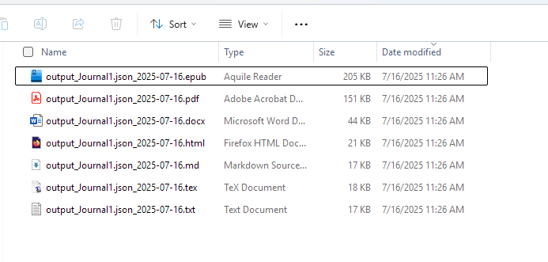

Of course! A good README file is essential for any GitHub project. Here is a comprehensive README.md file, complete with emojis and all the details you requested.

You can copy and paste the text below directly into a new file named `README.md` in your GitHub repository.

---

# 📔 Day One Journal Exporter  multifaceted

A powerful Python script to convert your [Day One](https://dayoneapp.com/) journal exports into multiple formats, beautifully organized and ready for archiving or sharing.

 

## ✨ Features

*   **Chronological Sorting 📅**: Automatically sorts your journal entries by their creation date, no matter how they are ordered in the export file.
*   **Multiple Formats 📚**: Converts your journal into:
    *   📄 Plain Text (`.txt`)
    *   ✒️ LaTeX (`.tex`) for professional typesetting
    *   ✍️ Microsoft Word (`.docx`)
    *   📑 PDF (requires Word on Windows)
    *   📖 EPUB (`.epub`) for e-readers
*   **Markdown Preservation 💅**: Keeps your Markdown formatting intact, including headers, bold, italics, and more.
*   **Smart EPUB Creation 🧠**:
    *   Generates a dynamic Table of Contents based on your entries' `# H1 titles`.
    *   Falls back to creating chapters by date if no H1 titles are found.
    *   Allows you to add a custom book cover!
*   **Organized Output 📂**: Creates a dedicated folder for each journal file, keeping all your converted documents tidy.

## 🚀 How to Use

### 1. Prerequisites

You need to have Python 3 installed. Then, install the required libraries using pip:

```bash
pip install python-docx docx2pdf EbookLib
```

> **Note on PDF Conversion**: The `docx2pdf` library requires **Microsoft Word** to be installed on a **Windows** machine. If you are on macOS or Linux, the script will skip the PDF conversion step without crashing.

### 2. Setup

1.  **Export Your Journal**: From the Day One app, export your journal as a `.json` file.
2.  **Place Your Files**: Put the exported `YourJournal.json` file in the same directory as the Python script.
3.  **(Optional) Add a Cover**: If you want a cover for your EPUB file, place an image named exactly `cover.jpg` in the same directory.

The folder structure should look like this:

```
.
├── Journal1.json        <-- Your Day One export
├── cover.jpg            <-- Your optional EPUB cover
└── journal_converter.py <-- This Python script
```

### 3. Configure the Script

Open the Python script in a text editor and change the `jsonName` variable to match the name of your exported file.

```python
# === Load JSON data ===
# Change "Journal1.json" to the name of your file
jsonName="Journal1.json" 
with open(jsonName, "r", encoding="utf-8") as f:
    data = json.load(f)
```

### 4. Run the Script!

Execute the script from your terminal:

```bash
python journal_converter.py
```

## 📂 What to Expect

After the script runs, it will create a new folder named after your JSON file (e.g., a folder called `Journal1`). Inside, you will find all your beautifully converted journal files!

```
.
├── Journal1/              <-- Your new, organized folder!
│   ├── output_Journal1.json_YYYY-MM-DD.docx
│   ├── output_Journal1.json_YYYY-MM-DD.epub
│   ├── output_Journal1.json_YYYY-MM-DD.pdf
│   ├── output_Journal1.json_YYYY-MM-DD.tex
│   └── output_Journal1.json_YYYY-MM-DD.txt
├── Journal1.json
├── cover.jpg
└── journal_converter.py
```

---

Enjoy your newly archived journal! 🎉